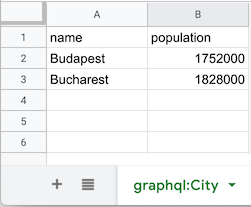

# sheets-apps-script-serverless-graphql

## About

This project allows you to expose a Google Sheet as a GraphQL API using a free Google Apps Script.

Note that the exposed parts are accessible without authentication.

This is an early proof of concept made for fun, while I was learning about GraphQL. It only supports reading at the moment, and it is not optimized for large datasets.

## Caveats

 - Due to Apps Script limitations, there is always a redirect before the API returns a result, and that confuses some GraphQL clients.
 - Due to Apps Script limitations, the Content-Type header in the response is "application/json; charset=utf-8", and that confuses some GraphQL clients as they expect "application/json".
 - Apps Script has quotas. (https://developers.google.com/apps-script/guides/services/quotas)
 - Apps Script response times are in general not great for exposed services.

## Requirements

* Node.js v8 or higher
* [Yarn 1](https://classic.yarnpkg.com/en/docs/install)
* [clasp](https://github.com/google/clasp)

## Install

### Install and setup clasp

1. Install [clasp](https://github.com/google/clasp), and [enable the Google Apps Script API](https://script.google.com/home/usersettings).

2. Login with your google account.

```
$ clasp login
```

### Install this project

```
$ git clone https://github.com/kalmi/sheets-apps-script-serverless-graphql.git
```

After cloning this repository:

```
$ cd sheets-apps-script-serverless-graphql
$ yarn install
```

## Create your first exposed sheet

### 1. Create a new Google Apps Script attached to a new Google Sheet.

```
$ clasp create --type sheets --rootDir ./dist
```

Alternatively you could add it to a preexisting sheet if you specify [--parentId](https://github.com/google/clasp/blob/master/README.md#create) instead of --type.

### 2. Replace the contents of dist/appsscript.json with the following

```
{
  "timeZone": "Europe/Paris",
  "dependencies": {
  },
  "oauthScopes": [
    "https://www.googleapis.com/auth/spreadsheets.currentonly"
  ],
  "webapp": {
    "access": "ANYONE_ANONYMOUS",
    "executeAs": "USER_DEPLOYING"
  },
  "exceptionLogging": "STACKDRIVER",
  "runtimeVersion": "V8"
}

```

### 3. Build the project

```
$ yarn build
```

### 4. Push the dist directory to Google Apps Script

```
$ yarn push -f
```

### 5. Create a deployment to expose the GrahpQL API

```
$ yarn deploy
```

### 6. Authorize access for the webapp to the spreadsheet

```
$ clasp open
```

- Open the "Publish" menu, and click "Deploy as web app.."
- Click "Update" in the dialog
- Click "Review permissions" 
- Follow the instructions displayed to authorize your application to access the spreadsheet
- Close the script editor

### 7. Add some data

- Open your spreadsheet in Google Sheets
- Rename your sheet to graphql:Customer (Only sheets with the `graphql:` prefix are exposed)
- Add headers, such as id name, age
- Add some data



### 8. Make your first query

```
wget https://script.google.com/macros/s/`cat .deploymentId`/exec -q -O- --post-data '{ "query": "{ City { name }}"}'
```

This should result in:
```
{
  "data": {
    "City": [
      {
        "name": "Budapest"
      },
      {
        "name": "Bucharest"
      }
    ]
  }
}
```

## Deploying a new version

```
$ yarn build
$ yarn push
$ yarn deploy
```

## Development

If you want to use watch mode, run the following command:

```
$ yarn watch
```

In watch mode, the build file is automatically pushed and deployed when saving the contents in the `src` folder.

## License

[MIT](LICENSE)
